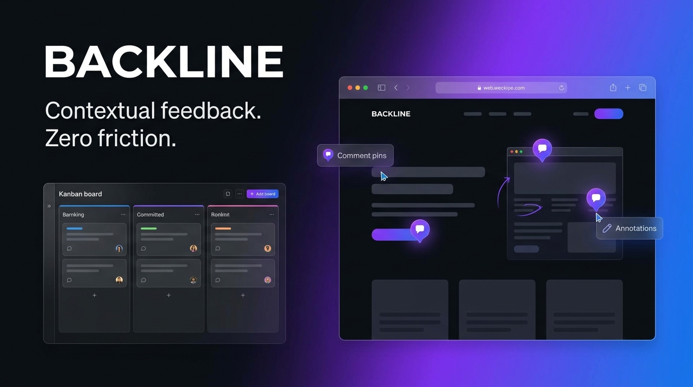

<p align="center">
  
</p>

<p align="center">
  <a href="https://github.com/backline/app/actions"></a>
  <a href="docs/spec/00-README.md"></a>
  <a href="DEPLOYMENT.md"></a>
  
  
  
</p>

---

**Backline** is a collaborative website review platform. Clients open a link, click anywhere on a live or staging site, and leave a contextual comment — no account, no browser extension, no install required. Agencies get a full dashboard, kanban/list workflow, thread replies, and integrations (Slack, ClickUp, Trello) so feedback never falls back to email.

> **Differentiator:** Comments attach to a **Persistent Anchor** — a structural + text + visual fingerprint of the DOM element, not to fragile x/y screen coordinates. When the page changes, the **Recovery Engine** re-locates the element and tells the user honestly when it can't.

---

## 📚 Documentation

| Document | Description |
|---|---|
| [`docs/spec/00-README.md`](docs/spec/00-README.md) | Master engineering specification (source of truth) |
| [`docs/implementation/00-index.md`](docs/implementation/00-index.md) | Final Draft product amendment, flow matrix & implementation plan |
| [`docs/spec/20-Build-Plan.md`](docs/spec/20-Build-Plan.md) | Milestone build order & Definition of Done |
| [`docs/launch-readiness.md`](docs/launch-readiness.md) | Acceptance-criteria traceability, rollback plan, on-call runbook |
| [`RUNNING_LOCALLY.md`](RUNNING_LOCALLY.md) | Click-by-click local dev guide (non-developer friendly) |
| [`DEPLOYMENT.md`](DEPLOYMENT.md) | Production deployment guide |

---

## ✅ Milestone Status

All **13 milestones (M0–M12)** are complete.

| Milestone | Feature | Status |
|---|---|---|
| M0 | Monorepo + CI | ✅ |
| M1 | Auth & Workspaces | ✅ |
| M2 | Projects & Share Links | ✅ |
| M3 | Review SDK v1 + Snapshot Engine v1 | ✅ |
| M4 | Comments Core + Dual Layer | ✅ |
| M5 | Anchor Engine v1 (tiered matching + SimHash) | ✅ |
| M6 | Dashboard Board (kanban + list, bulk actions) | ✅ |
| M7 | Realtime Layer (WebSocket + Redis pub/sub) | ✅ |
| M8 | Revision Engine + Recovery Pipeline v1 | ✅ |
| M9 | Proxy Mode + Onboarding Polish | ✅ |
| M10 | Notifications & Integrations (Slack, ClickUp, Trello) | ✅ |
| M11 | Security, Performance & Accessibility Hardening | ✅ |
| M12 | Launch Readiness (reply UI, Playwright journeys, Sentry, smoke/soak tests) | ✅ |

> 168 backend tests, all green. Full Playwright e2e suite covering every dashboard screen and the widget's shadow-DOM UI.

---

## 🏗️ Repository Layout

```
apps/
  web/        Agency dashboard (React + Vite)
  widget/     Review SDK bundle (vanilla TS, injected into reviewed sites)
  e2e/        Playwright accessibility + performance + e2e test suite
  extension/  Browser extension (optional install mode)
backend/      FastAPI application (router → service → repository)
packages/
  ui/         Shared design-system components
  types/      Generated TypeScript types from the backend's OpenAPI schema
docs/
  spec/       The 20-file engineering specification (source of truth)
  tdr/        Technical Decision Records (dated amendments)
  implementation/  Final Draft product flows and delivery tracking
infra/        Local dev service scripts + Docker Compose
scripts/      Repo-level helper scripts
```

---

## 🚀 Quick Start (Local Development)

**Prerequisites:** Node 20, pnpm, Python 3.12, and either Docker or native `mongod` / `redis-server` / `minio` binaries on `PATH`.

> No Docker? See [`docs/tdr/0001-local-toolchain-without-docker.md`](docs/tdr/0001-local-toolchain-without-docker.md). Full click-by-click guide: [`RUNNING_LOCALLY.md`](RUNNING_LOCALLY.md).

```bash
# 1. Start Mongo / Redis / MinIO
./infra/local/start-all.sh          # native binaries, or:
docker compose up -d                # if you have Docker

# 2. Backend
cd backend
uv sync
uv run uvicorn app.main:app --reload --port 8000

# 3. Background worker (separate terminal — from backend/)
#    Handles: recovery pipeline (M8), integration dispatch,
#    webhook retries, and email digests (M10).
uv run arq app.workers.main.WorkerSettings

# 4. Frontend (separate terminal — from repo root)
pnpm install
pnpm --filter @backline/web dev

# 5. Widget bundle (build at least once)
pnpm --filter @backline/widget build
```

| Service | URL |
|---|---|
| Dashboard | http://localhost:5173 |
| Backend API docs | http://localhost:8000/docs |

```bash
# Stop native local services
./infra/local/stop-all.sh
```

### Trying the widget yourself

```bash
# With the backend + local services running, and a share link token in hand:
cd apps/widget && pnpm build
python3 -m http.server 4173
# Open: http://localhost:4173/test-site/index.html?shareToken=<your-token>
```

---

## 🔑 Credentials & Third-Party Setup

| Service | Required for | Setup |
|---|---|---|
| Google OAuth | Member sign-in via Google | See `.env.example` |
| Resend | OTP emails + daily digest | See `.env.example` |
| ClickUp OAuth | ClickUp integration | Needs real ClickUp app credentials |
| Slack | Slack integration | Paste a webhook URL — no app registration needed |
| Trello | Trello integration | Paste API key + token — no app registration needed |

> Without credentials, OTP codes and email digests are **logged to the server console** instead of sent. The Google / ClickUp connect buttons will fail at the provider's OAuth redirect — the rest of the app works fully without them.

---

## 🛠️ Common Commands

```bash
# Frontend — lint, typecheck, build all workspaces
pnpm turbo run lint typecheck build

# Backend — lint, typecheck, tests
cd backend
uv run ruff check .
uv run mypy app/
uv run pytest

# Workspace scoping audit (enforces tenant isolation)
cd backend && uv run python scripts/check_workspace_scoping.py
```

### Accessibility / Performance e2e suite (`apps/e2e`)

Requires the real stack running, with the frontend served via `vite preview` (production build — not `vite dev`).

```bash
# Build + preview frontend (separate terminal)
cd apps/web && pnpm build && pnpm preview --port 4173

# Run the suite
cd apps/e2e
BACKEND_LOG_PATH=<path-to-backend-stdout> \
WEB_BASE_URL=http://localhost:4173 \
pnpm test:a11y    # or test:perf, or test:e2e (full suite)
```

### Deploy readiness (`backend/scripts`)

```bash
cd backend

# Post-deploy health gate (/health + /openapi.json)
uv run python scripts/smoke_test.py [base_url]

# 90-second load test (38 k requests, 8 concurrent workers)
uv run python scripts/soak_test.py --backend-log <path> --duration 90 --concurrency 8
```

---

## 🔄 Regenerating API Types

Whenever backend routes or schemas change, regenerate `packages/types` against a running backend:

```bash
cd packages/types && pnpm generate
```

---

## 🔐 Security & Multi-tenancy

- Every query and mutation carries **workspace scope** — zero cross-tenant leaks (verified by a full manual audit + an ongoing AST-based CI lint rule).
- Guest APIs never expose team content or client contact records.
- Rate limiting applied to all guest-writable endpoints.
- `pip-audit` / `pnpm audit` clean.

---

## 📖 Architecture at a Glance

```
Browser (Guest)
  └─ Review Widget (apps/widget) ──────────────────┐
                                                    ▼
Browser (Agency)                           FastAPI Backend (backend/)
  └─ Dashboard (apps/web)  ───── REST/WS ──► Router → Service → Repository
                                                    │
                          ┌─────────────────────────┤
                          │                         │
                       MongoDB                    Redis
                    (comments,                (pub/sub, job
                    anchors, revisions)         queues via Arq)
                          │
                        MinIO / S3-compatible
                    (screenshots, DOM snapshots)
```

See [`docs/spec/03-System-Architecture.md`](docs/spec/03-System-Architecture.md) for the full layered architecture.

---

## 🤝 Contributing

1. Read the [Engineering Principles](docs/spec/02-Engineering-Principles.md) before touching anything.
2. All new behaviour must have a corresponding Playwright e2e test.
3. Run `pnpm turbo run lint typecheck build` (frontend) and `uv run ruff check . && uv run mypy app/ && uv run pytest` (backend) before opening a PR.
4. Significant scope or design changes require a dated TDR in `docs/tdr/`.

---

<p align="center">Built with ♥ by the Backline team</p>
